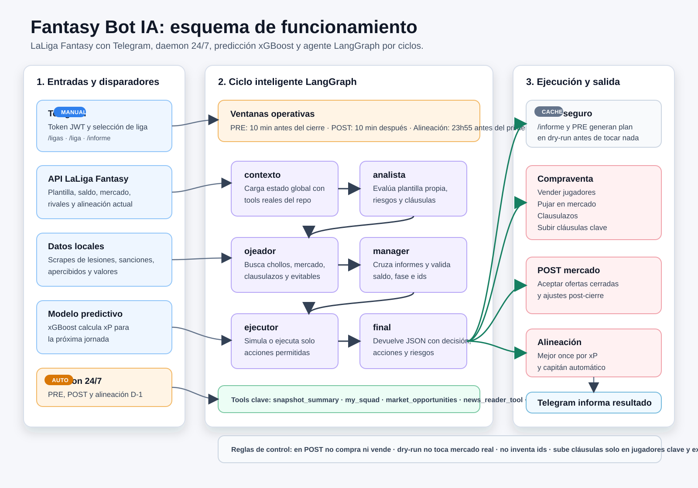

# Fantasy Bot IA (LangGraph)

## 1. Que hace el bot

El bot gestiona tu equipo de LaLiga Fantasy de forma autonoma 24/7 con un
grafo LangGraph por ciclos.

- Usa herramientas del repo + API real de LaLiga Fantasy para analizar plantilla, mercado y expected points.
- Lee noticias/scrapes locales desde `scrapes/` con `news_reader_tool` para lesiones, sanciones, apercibidos y valores de mercado.
- Orquesta el ciclo como nodos: contexto -> analista -> ojeador -> manager -> ejecutor.
- El modelo de prediccion es fijo: `xgboost`.
- La liga se elige en Telegram por nombre: `/ligas` y `/liga <nombre>`.
- Al elegir la liga, el bot detecta automaticamente la hora real de cierre del mercado leyendo la expiracion de jugadores publicados.
- Regla crítica: los clausulazos están prohibidos desde 24h antes del primer partido de la jornada; en esa ventana el bot debe saltarlos y operar solo con pujas de mercado, ventas o subidas de cláusula.
- Regla critica de saldo: si el saldo esta negativo, el bot activa modo deuda. No compra ni sube clausulas hasta recuperar saldo >= 0; vende primero jugadores de impacto bajo o nulo, considerando xP, valor de mercado, clausula y que la plantilla siga pudiendo alinear un once valido.
- PRE mercado: se ejecuta siempre 10 minutos antes del cierre real.
- POST mercado: se ejecuta siempre 10 minutos despues del cierre real.
- Guarda la alineacion exactamente 23 horas y 55 minutos antes del inicio de la jornada.
- Puede proteger plantilla subiendo clausulas de jugadores clave cuando estan expuestos a clausulazo.
- Si el token falta o caduca, te avisa por Telegram para renovarlo.

### Arquitectura LangGraph



El estado global viaja por el grafo con plantilla, saldo, puntos, mercado,
predicciones, noticias, informes y acciones.

1. `contexto`
   - Ejecuta `snapshot_summary`, `my_squad`, `market_opportunities`, `news_reader_tool`, `simulate_transfer_plan` y `current_lineup`.
   - Carga plantilla, presupuesto, puntos, mercado disponible, xP y noticias locales.
2. `analista`
   - Sub-agente LLM especializado en la plantilla propia.
   - Propone a quien alinear, sentar, vender o proteger con clausula.
3. `ojeador`
   - Sub-agente LLM especializado en mercado y clausulazos.
   - Detecta chollos, jugadores a evitar y riesgos de mercado.
4. `manager`
   - LLM principal.
   - Recibe contexto, informe del analista, informe del ojeador y acciones propuestas por el motor.
   - Valida saldo, fase operativa y limites antes de decidir.
5. `ejecutor`
   - Ejecuta o simula herramientas reales: ventas, pujas, clausulazos, subidas de clausula, ofertas cerradas y alineacion.
   - Respeta `dry-run` y bloqueos por fase.

Puedes volver al ejecutor anterior con:

```env
FANTASY_AGENT_ENGINE=legacy
```

### Operativa (PRE, POST, /informe, /compraventa, /ventas y /optimizar)

- PRE (automatico, 10 min antes del cierre):
  - Lo lanza el daemon autónomo.
  - Ejecuta el mismo flujo que `/informe` + `/compraventa` en ese ciclo.
  - Primero genera el plan del ciclo en simulacion y despues ejecuta en real ese plan (si el daemon no esta en `dry-run`).
  - Incluye ventas, pujas, clausulazos y subidas de clausula cuando aplique.

- POST (automatico, 10 min despues del cierre):
  - Lo lanza el daemon autónomo.
  - Ejecuta tareas de post-cierre (por ejemplo aceptar ofertas cerradas) y ajustes de gestion.

- /informe (manual en Telegram):
  - Ejecuta el agente IA en simulacion (`dry-run`), sin tocar mercado real.
  - Genera un informe del ciclo actual.
  - Guarda un plan ejecutable en cache para ese ciclo de mercado (ventas, pujas, clausulazos y subida de clausula).
  - Si faltan 24h o menos para la jornada, no debe cachear clausulazos.

- /compraventa (manual en Telegram):
  - Ejecuta en real exactamente el plan cacheado del ultimo `/informe`.
  - Solo se permite si ese `/informe` es del mismo ciclo de mercado.
  - Si el ciclo cambió, bloquea la ejecución y obliga a lanzar `/informe` de nuevo para evitar operar con plan deprecado.
  - Antes de ejecutar revalida la regla de 24h: si el plan cacheado contiene clausulazos y la jornada está a 24h o menos, los salta sin llamar a la API.
  - Si el plan incluye subida de clausula, aplica la regla fija: por cada 1M invertido sube 2M la clausula.

- /ventas (manual en Telegram):
  - Ejecuta la fase 2 de ventas: aceptar ofertas de la liga para jugadores ya publicados y con mercado cerrado.
  - Equivale a `--aceptar-ofertas` y se puede lanzar cuando quieras, independientemente de `/compraventa`.
  - Si aún no cerró mercado o no hay ofertas pendientes, no hace cambios.

- /optimizar (manual en Telegram):
  - Recalcula y guarda en ese momento la mejor alineacion por xP.
  - Fuerza la optimizacion inmediata (no espera a ventana PRE/POST).
  - Guarda la alineacion y capitan en la API de LaLiga Fantasy.

## 2. Como ponerlo a funcionar

1. Crea el entorno:

```bash
cp .env.example .env
```

2. Rellena en `.env` solo lo necesario:

```env
OPENAI_API_KEY=...
FANTASY_AGENT_ENGINE=langgraph
LANGCHAIN_LLM_MODEL=gpt-5-mini
TELEGRAM_BOT_TOKEN=...
TELEGRAM_CHAT_ID=...
TELEGRAM_ALLOWED_CHAT_ID=...
```

### Observabilidad con LangSmith

Para activar trazas del agente, añade también:

```env
LANGSMITH_TRACING=true
LANGSMITH_API_KEY=...
LANGSMITH_PROJECT=fantasy-bot-dev
LANGSMITH_ENDPOINT=https://api.smith.langchain.com
LANGCHAIN_CALLBACKS_BACKGROUND=true
```

Usa proyectos separados para desarrollo y producción, y valida primero con `dry-run`.
La guía completa está en [docs/LANGSMITH.md](docs/LANGSMITH.md).

### Obtener variables de Telegram

1. Crea el bot con `@BotFather`:
- En Telegram abre `@BotFather`.
- Ejecuta `/newbot`.
- Sigue los pasos y copia el token que te da.
- Ese valor es `TELEGRAM_BOT_TOKEN`.

2. Obtén tu `chat_id`:
- Abre chat con tu bot y envía `/start`.
- Ejecuta:

```bash
curl "https://api.telegram.org/bot<TELEGRAM_BOT_TOKEN>/getUpdates"
```

- Busca el campo `message.chat.id` en la respuesta.
- Ese valor es `TELEGRAM_CHAT_ID`.

3. Define `TELEGRAM_ALLOWED_CHAT_ID`:
- Si solo quieres permitir tu chat, usa el mismo valor que `TELEGRAM_CHAT_ID`.
- Si usas grupo, añade el bot al grupo, envía un mensaje y vuelve a ejecutar `getUpdates` para tomar el `chat.id` del grupo.

4. Arranca el bot:

```bash
docker compose build
docker compose up -d
docker compose logs -f autonomous-bot
```

5. En Telegram:
- Envia el token (JWT `eyJ...` o URL de `jwt.ms`).
- Ejecuta `/ligas`.
- Ejecuta `/liga <nombre>`.

Al seleccionar la liga, el bot te respondera con la hora de mercado detectada y confirmara que PRE y POST se ejecutan 10 minutos antes/despues.
