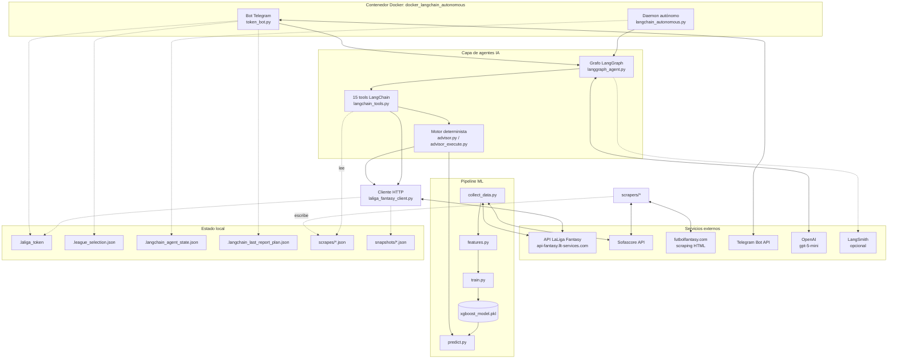
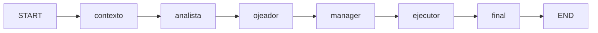

# Fantasy Bot — Documentación técnica

> Documentación generada a partir de la lectura del código en el commit `b934310`
> (rama `codex/agents`, 2026-07-30), actualizada tras los cambios del mismo día:
> job de reentrenamiento periódico ([prediction/retrain.py](../prediction/retrain.py)),
> eliminación de `laliga_fantasy_api.py` y limpieza de variables huérfanas del `.env`.
> Lo que no pudo verificarse en el código se marca como **Pendiente de confirmar**.

---

## 1. Resumen ejecutivo

**Fantasy Bot** es un gestor autónomo 24/7 de un equipo de **LaLiga Fantasy** (el juego oficial de LaLiga). Está pensado para un único usuario/mánager que quiere delegar la gestión diaria de su equipo: el bot analiza plantilla y mercado, predice los puntos esperados (xP) de cada jugador con un modelo XGBoost, decide compras, ventas, clausulazos, subidas de cláusula y alineación mediante un agente LLM orquestado con **LangGraph**, y ejecuta esas operaciones contra la **API no oficial de LaLiga Fantasy** (obtenida por ingeniería inversa del APK de la app Android).

Responsabilidades principales:

- **Predicción**: modelo XGBoost entrenado con histórico de puntos Fantasy, forma reciente, dificultad del rival y cuotas de apuestas (Sofascore).
- **Decisión**: grafo LangGraph con sub-agentes LLM (analista, ojeador, manager) sobre un motor determinista de reglas ([advisor.py](../prediction/advisor.py)) que es quien realmente autoriza las acciones.
- **Ejecución**: ventas (fase 1 y fase 2), pujas, clausulazos, subidas de cláusula y guardado de alineación vía [laliga_fantasy_client.py](../laliga_fantasy_client.py).
- **Operación**: daemon en Docker con ventanas automáticas PRE (cierre de mercado − 10 min) y POST (cierre + 10 min), alineación 23 h 55 min antes de la jornada, y un bot de Telegram para control manual (`/informe`, `/compraventa`, `/ventas`, `/optimizar`) y renovación del token de sesión.

El sistema **no expone ninguna API propia**: es un consumidor de APIs de terceros (LaLiga Fantasy, Sofascore, Telegram, OpenAI) más scraping de futbolfantasy.com.

---

## 2. Arquitectura

### 2.1 Vista general



### 2.2 Capas

| Capa | Módulos | Rol |
|---|---|---|
| Cliente API | `laliga_fantasy_client.py` | Única capa HTTP viva contra LaLiga Fantasy. Auth por token JWT manual, operaciones de mercado y alineación, snapshots de liga. |
| Pipeline ML | `prediction/collect_data.py`, `features.py`, `train.py`, `predict.py`, `retrain.py` | Recolección → features → entrenamiento XGBoost → predicción de xP. `retrain.py` lo reejecuta automáticamente cuando hay jornada nueva completada (ver §6.5). |
| Motor determinista | `prediction/advisor.py`, `advisor_execute.py` | Reglas de negocio: plan de traspasos, modo deuda, ventana 24 h de clausulazos, once óptimo, ejecución real. |
| Agentes IA | `prediction/langgraph_agent.py`, `langchain_agent.py`, `langchain_tools.py` | Grafo de 6 nodos (3 llamadas LLM) que razona sobre el contexto y valida acciones contra el plan del motor. |
| Operación | `prediction/langchain_autonomous.py`, `docker_langchain_autonomous.py`, `token_bot.py`, `retrain.py` | Scheduler PRE/POST/alineación + bot de Telegram + reentrenamiento periódico, como hilos del mismo contenedor. |
| Scrapers de noticias | `scrapers/*` | Lesionados, sancionados, apercibidos y variaciones de valor de mercado. Alimentan al LLM (RAG local), **no** al modelo ML. |
| Observabilidad | `prediction/langsmith_config.py` | Trazas LangSmith opcionales con sanitización de secretos. |

### 2.3 El grafo LangGraph

El grafo es **lineal, sin aristas condicionales** ([langgraph_agent.py:1060-1074](../prediction/langgraph_agent.py)):



- **contexto** (`:827-866`): garantiza scrapes frescos (`ensure_fresh_scrapes`), invoca 6 tools en orden fijo (`snapshot_summary`, `my_squad`, `market_opportunities`, `news_reader_tool`, `simulate_transfer_plan`, `current_lineup`) y deriva `acciones_propuestas_motor` — la única fuente de acciones que el ejecutor aceptará.
- **analista** (`:868-891`): sub-agente LLM sobre la plantilla propia. Salida JSON: alinear/sentar/vender/proteger.
- **ojeador** (`:893-916`): sub-agente LLM sobre mercado y clausulazos. Salida JSON: chollos/evitar/riesgos.
- **manager** (`:918-946`): LLM principal; decide `acciones_ejecutables` respetando 9 reglas (fase POST sin compras, modo deuda, regla 1M→2M, bloqueo 24 h…).
- **ejecutor** (`:948-1016`): en fase POST ignora al manager y ejecuta fijo `accept_closed_offers` + alineación. En PRE/full aplica tres filtros: whitelist de tools + coincidencia con `acciones_propuestas_motor` (con sustitución de importes divergentes), blindaje determinista de cláusulas (ratio ≥ 0.88 y xP ≥ 5.0), y validación financiera (ventas fase 1 **no** financian compras).
- **final** (`:1018-1058`): serializa la salida JSON del ciclo.

Punto clave de diseño: **el LLM no puede inventar operaciones**. Solo puede aprobar/descartar acciones que el motor determinista ya propuso; los importes los fija el motor.

Existe un motor alternativo `legacy` (`FANTASY_AGENT_ENGINE=legacy`): un `AgentExecutor` clásico de LangChain con las 15 tools expuestas al LLM y un único prompt ([langchain_agent.py:152-202](../prediction/langchain_agent.py)). El selector está en `run_agent_objective` (`langchain_agent.py:342-379`).

---

## 3. Estructura del repositorio

```
fantasy-bot/
├── laliga_fantasy_client.py    # Cliente API (librería + CLI). 2556 líneas.
├── prediction/                 # Núcleo del sistema
│   ├── collect_data.py         #   Recolección de datos (LaLiga Fantasy + Sofascore)
│   ├── features.py             #   Feature engineering → features.csv
│   ├── train.py                #   Entrenamiento XGBoost (walk-forward)
│   ├── predict.py              #   Predicción de xP para la próxima jornada
│   ├── retrain.py              #   Job de reentrenamiento periódico (collect→features→train)
│   ├── advisor.py              #   Motor determinista de reglas y plan de traspasos
│   ├── advisor_execute.py      #   Ejecución real del plan (ventas f1/f2, compras)
│   ├── langgraph_agent.py      #   Grafo LangGraph (motor por defecto)
│   ├── langchain_agent.py      #   Selector de motor + agente legacy + CLI
│   ├── langchain_tools.py      #   FantasyAgentRuntime + 15 tools LangChain
│   ├── langchain_autonomous.py #   Daemon: ventanas PRE/POST + alineación
│   ├── docker_langchain_autonomous.py  # Runner Docker (daemon + token bot + retrain en hilos)
│   ├── token_bot.py            #   Bot de Telegram (comandos + renovación de token)
│   ├── telegram_messages.py    #   Formateo HTML de mensajes
│   ├── telegram_notify.py      #   Envío con chunking + URL de login canónica
│   ├── market_schedule.py      #   Detección del cierre real de mercado
│   ├── lineup_autoset.py       #   Guardado del mejor once por xP
│   ├── league_selection.py     #   Persistencia de la liga activa
│   ├── scrape_freshness.py     #   Garantiza scrapes recientes (subproceso)
│   ├── langsmith_config.py     #   Observabilidad opcional
│   ├── models/                 #   xgboost_model.pkl + xgboost_meta.json
│   └── data/                   #   raw_dataset.json, features.csv, oof, predicciones
├── scrapers/                   # futbolfantasy (lesiones/sanciones/apercibidos),
│   └── ...                     # sofascore (stats), market_values; scrape_all orquesta
├── scrapes/                    # (gitignored) Snapshots JSON de noticias con timestamp
├── snapshots/                  # (gitignored) Snapshots de liga por league_id
├── test/                       # unittest + un script manual contra la API real
├── scripts/                    # Utilidades: check_langsmith, debug_team_api, wrapper token bot
├── docs/                       # API_ENDPOINTS_APK.md, LANGCHAIN_AGENT.md, LANGSMITH.md
├── apk/                        # APKs decompilados (fuente de los endpoints)
├── Dockerfile / docker-compose.yml
├── .env.example                # Plantilla de configuración
└── .laliga_token, .league_selection.json, .langchain_agent_state.json,
    .langchain_last_report_plan.json   # Estado en runtime (ver §9)
```

**Tecnologías**: Python 3.11 (imagen `python:3.11-slim`), requests + BeautifulSoup/lxml, pandas/numpy/scikit-learn/xgboost, LangChain ≥ 0.3 + langchain-openai + LangGraph ≥ 0.2 + LangSmith, Docker Compose. Sin framework web ni base de datos: toda la persistencia es en ficheros JSON/CSV/pickle.

---

## 4. Instalación y configuración

### Requisitos previos

- Docker + Docker Compose (despliegue recomendado) o Python 3.11 con `pip install -r requirements.txt`.
- Cuenta de LaLiga Fantasy (el login es vía Azure B2C; con Google el token se obtiene manualmente, ver §6.1).
- Bot de Telegram creado con `@BotFather`.
- API key de OpenAI.

### Variables de entorno (`.env`, plantilla en [.env.example](../.env.example))

| Variable | Default | Uso |
|---|---|---|
| `OPENAI_API_KEY` | — (obligatoria) | LLM `ChatOpenAI` ([langgraph_agent.py:1093-1097](../prediction/langgraph_agent.py)) |
| `FANTASY_AGENT_ENGINE` | `langgraph` | Motor: `langgraph` o `legacy` (alias `LANGCHAIN_AGENT_ENGINE`) |
| `LANGCHAIN_LLM_MODEL` | `gpt-5-mini` | Modelo LLM |
| `LANGCHAIN_TEMPERATURE` / `LANGCHAIN_MAX_ITERATIONS` | `0.1` / `20` | Config LLM (`max_iterations` solo limita de verdad en `legacy`) |
| `TELEGRAM_BOT_TOKEN` / `TELEGRAM_CHAT_ID` | — | Bot y chat de notificaciones |
| `TELEGRAM_ALLOWED_CHAT_ID` | vacío | **Autorización de comandos. Si queda vacío, cualquier chat puede operar el bot** ([token_bot.py:1937](../prediction/token_bot.py)) |
| `TOKEN_MAX_AGE_HOURS` / `TOKEN_ALERT_COOLDOWN_MINUTES` | `23` / `360` | Caducidad heurística del token y cooldown de alertas |
| `TOKEN_BOT_ENABLED` / `TOKEN_BOT_POLL_TIMEOUT` | `1` / `50` | Hilo del bot de Telegram en el contenedor |
| `TZ` | `Europe/Madrid` | Zona horaria de ventanas y mensajes |
| `LALIGA_LEAGUE_ID` | — | Liga fija (normalmente se selecciona por Telegram) |
| `LALIGA_USERNAME` / `LALIGA_PASSWORD` | — | Solo login email+password (cuentas no federadas) |
| `SCRAPES_MAX_AGE_MINUTES` / `SCRAPER_TIMEOUT_SECONDS` | `120` / `90` | Frescura de noticias |
| `LINEUP_AUTO_AFTER_TIME` / `LINEUP_ERROR_RETRY_SECONDS` | `08:10` / `3600` | Alineación (ruta D-1) y backoff tras error |
| `CLAUSE_PROTECTION_INVESTMENT` | `50000` | Inversión por subida de cláusula determinista (no documentada en `.env.example`) |
| `RETRAIN_ENABLED` / `RETRAIN_TIME` | `1` / `05:30` | Job de reentrenamiento diario del modelo xP ([retrain.py](../prediction/retrain.py)) |
| `RETRAIN_MAX_AGE_DAYS` / `RETRAIN_STEP_TIMEOUT_SECONDS` / `RETRAIN_ERROR_RETRY_SECONDS` | `7` / `1800` / `21600` | Fallback por edad si la API no responde, timeout por paso y backoff tras error |
| `LANGCHAIN_STATE_FILE` | `.langchain_agent_state.json` | Fichero de estado del daemon |
| `LANGCHAIN_PRE_OBJECTIVE` / `LANGCHAIN_POST_OBJECTIVE` | — | Objetivos custom de fase |
| `LANGSMITH_TRACING`, `LANGSMITH_API_KEY`, `LANGSMITH_PROJECT`, `LANGSMITH_ENDPOINT`, `LANGCHAIN_CALLBACKS_BACKGROUND` | off | Observabilidad (ver [docs/LANGSMITH.md](LANGSMITH.md)) |

Nota: las variables huérfanas de versiones anteriores (`AUTOPILOT_*`, `LINEUP_AUTO_ENABLED`, `LINEUP_AUTO_DAY_BEFORE_ONLY`) fueron eliminadas del `.env` el 2026-07-30; solo `LINEUP_AUTO_AFTER_TIME` tiene consumidor ([lineup_autoset.py:222](../prediction/lineup_autoset.py)).

### Puesta en marcha

```bash
cp .env.example .env   # rellenar OPENAI_API_KEY y TELEGRAM_*
docker compose build
docker compose up -d
docker compose logs -f autonomous-bot
```

Después, en Telegram: enviar el token de sesión (JWT o URL de `jwt.ms`), `/ligas`, `/liga <nombre>`. El bot confirma la hora de cierre de mercado detectada.

---

## 5. Ejecución

### Producción (Docker)

`docker-compose.yml` arranca `python -m prediction.docker_langchain_autonomous`, que lanza tres hilos daemon (scheduler, bot Telegram y reentrenamiento del modelo) con watchdog: si un hilo muere, el proceso cae y `restart: unless-stopped` lo reinicia ([docker_langchain_autonomous.py](../prediction/docker_langchain_autonomous.py)).

### CLIs individuales (desarrollo)

```bash
# Pipeline ML (el daemon lo reejecuta a diario vía prediction.retrain; ver §6.5)
python -m prediction.collect_data [--max-players N]   # → prediction/data/raw_dataset.json
python -m prediction.features                         # → prediction/data/features.csv
python -m prediction.train                            # → prediction/models/xgboost_model.pkl
python -m prediction.predict [--top N] [--position POR|DEF|MED|DEL]

# Reentrenamiento (los 3 pasos anteriores en subprocesos, con estado y notificación)
python -m prediction.retrain --check                  # ¿tocaría reentrenar? (no ejecuta)
python -m prediction.retrain --force                  # reentrena ya, ignorando la ventana


# Agente IA (simulación o real)
python -m prediction.langchain_agent --objective "..." [--engine langgraph|legacy] [--dry-run]

# Daemon en local
python -m prediction.langchain_autonomous [--dry-run] [--league ID]

# Alineación
python -m prediction.lineup_autoset [--force] [--dry-run] [--no-day-before-check]

# Scrapers de noticias
python -m scrapers.scrape_all [--output PATH]

# Cliente API (CLI)
python laliga_fantasy_client.py --google      # abre navegador para login
python laliga_fantasy_client.py --token "https://jwt.ms/#id_token=eyJ..."
```

### Tests

```bash
python -m unittest discover -s test -t . -v      # unit tests (sin red)
python -m test.test_all_apis --league <ID>       # script manual: requiere red + token válido
```

No hay `pytest` en `requirements.txt` ni configuración de lint/formateo (no existen `ruff`, `black`, `flake8`, `pre-commit` ni CI). **Pendiente de confirmar** si se usa alguna herramienta externa al repo.

### Migraciones / tareas administrativas

No aplican (sin base de datos). La única tarea recurrente manual es **renovar el token** (~cada 24 h, vía Telegram) y, cuando se quiera refrescar el modelo, reejecutar el pipeline ML.

---

## 6. Flujo de funcionamiento

### 6.1 Renovación del token (manual, ~diaria)

1. El daemon detecta token ausente/caducado (edad > `TOKEN_MAX_AGE_HOURS`, [token_bot.py:1073-1092](../prediction/token_bot.py)) y envía por Telegram la URL de login canónica de Azure B2C con `redirect_uri=https://jwt.ms` ([telegram_notify.py:19-51](../prediction/telegram_notify.py)).
2. El usuario inicia sesión en el navegador y pega en el chat la URL resultante de `jwt.ms` (o el JWT suelto).
3. `_extract_token_from_text` extrae el JWT y `save_token` lo persiste en `.laliga_token` con `saved_at` ([laliga_fantasy_client.py:443-451](../laliga_fantasy_client.py)).
4. Si el usuario tiene una única liga, se auto-selecciona y se responde con el horario de mercado.

No hay renovación automática: la caducidad se estima por la edad del fichero (23 h hardcodeadas en `load_token`, [laliga_fantasy_client.py:467](../laliga_fantasy_client.py)), **no** leyendo el claim `exp` del JWT.

### 6.2 Ciclo de mercado automático (PRE/POST)

1. Cada 5 min el daemon recalcula el cierre real del mercado: lee `expirationDate` de los jugadores publicados **por la liga**, toma la moda por minuto y trunca al bloque de 5 min anterior ([market_schedule.py:46-72](../prediction/market_schedule.py)). Ese instante define el `market_key` (identificador del ciclo).
2. **PRE** (cierre − 10 min, idempotente por `market_key`): ejecuta el grafo completo con `dry_run=True` para generar el plan, lo cachea en `.langchain_last_report_plan.json`, envía el informe por Telegram y, si el daemon no está en `--dry-run`, ejecuta el plan en real con `_execute_cached_actions` ([langchain_autonomous.py:273-409](../prediction/langchain_autonomous.py)).
3. **POST** (cierre + 10 min, sobre el mismo ciclo gracias a `pending_post_*`): ejecuta la fase `post` del grafo, que ignora la decisión del LLM y lanza fijo `accept_closed_offers` (fase 2 de ventas) + `autoset_best_lineup_tool` ([langgraph_agent.py:956-967](../prediction/langgraph_agent.py)).

### 6.3 Comandos manuales de Telegram

- **`/informe`**: grafo en `dry-run` → informe + plan cacheado para el ciclo actual. Aplica filtro de modo deuda y no cachea clausulazos si la jornada está a ≤ 24 h.
- **`/compraventa`**: **no llama al LLM**; ejecuta el plan cacheado con 4 guardas: caché existente, misma liga, mismo `market_key` y no ejecutado antes ([token_bot.py:1401-1478](../prediction/token_bot.py)). Durante la ejecución revalida modo deuda, ventana 24 h (fail-closed), saldo restante y duplicados de venta.
- **`/ventas`**: fase 2 — acepta las ofertas de la liga sobre jugadores ya publicados y con expiración vencida ([advisor_execute.py:391-464](../prediction/advisor_execute.py)).
- **`/optimizar`**: fuerza el cálculo y guardado inmediato del mejor once por xP con capitán (máximo xP entre jugadores de campo).
- **`/ligas`, `/liga <nombre>`**: listado y selección de liga (persistida en `.league_selection.json`).
- **`/status`, `/token`, `/help`**: estado y renovación.

### 6.4 Alineación automática

El daemon calcula `first_match_ts` de la próxima jornada (`predict.get_next_round`) y programa el guardado de alineación **23 h 55 min antes** ([langchain_autonomous.py:53, 494-590](../prediction/langchain_autonomous.py)). El once se elige evaluando todas las formaciones legales (DEF 2-5 / MED 2-5 / DEL 1-3, 1 POR) y maximizando xP ([advisor.py:417-473](../prediction/advisor.py)). Idempotente por jornada, con backoff de 1 h tras error.

### 6.5 Reentrenamiento automático del modelo

Un tercer hilo del contenedor ([retrain.py](../prediction/retrain.py), integrado en [docker_langchain_autonomous.py](../prediction/docker_langchain_autonomous.py)) comprueba cada 5 min si toca reentrenar. Se dispara **una vez al día, después de `RETRAIN_TIME`** (05:30 por defecto, hora en la que no hay ventanas de mercado), cuando se cumple alguna condición, en este orden:

1. Falta algún artefacto (`raw_dataset.json`, `features.csv`, `xgboost_model.pkl`) → `missing_artifacts`.
2. La API reporta una jornada completada posterior a la máxima del dataset (`weekNumber − 1 > dataset_max_jornada`) → `new_jornada`.
3. Si la API no responde: el dataset supera `RETRAIN_MAX_AGE_DAYS` (7 días) → `stale_age`.

Ejecuta `python -m prediction.collect_data`, `prediction.features` y `prediction.train` como **subprocesos** con timeout por paso (`RETRAIN_STEP_TIMEOUT_SECONDS`, 1800 s), aborta en el primer fallo, persiste el resultado en `.retrain_state.json` (gitignorado) y notifica por Telegram el éxito (con MAE/R² del walk-forward) o el fallo. Tras un error reintenta pasado `RETRAIN_ERROR_RETRY_SECONDS` (6 h). CLI manual: `python -m prediction.retrain [--check|--force]`.

Limitación conocida: los artefactos no se escriben de forma atómica; si una predicción coincidiera exactamente con la escritura del pickle podría fallar esa lectura (el daemon ya reintenta). La ventana de 05:30 minimiza el riesgo.

### 6.6 Reglas de negocio críticas

- **Regla 24 h de clausulazos**: prohibidos desde 24 h antes del primer partido de la jornada ([advisor.py:69, 232-260](../prediction/advisor.py)). Fuente primaria: calendario oficial (`/api/v3/calendar`); en ejecución real se usa `fail_closed=True` (si no puede verificarse la ventana, se bloquea).
- **Modo deuda**: con saldo < 0 solo se permiten ventas; el plan vende de forma voraz jugadores de menor impacto (buckets por disponibilidad/xP/once) hasta recuperar saldo ≥ 0, sin romper nunca un once válido ([advisor.py:966-1048](../prediction/advisor.py)).
- **Regla 1M → 2M**: cada subida de cláusula usa `factor=2.0` (por 1 M invertido, la cláusula sube 2 M) ([langchain_tools.py:44](../prediction/langchain_tools.py)).
- **Las ventas fase 1 no financian compras**: la validación financiera del ejecutor no cuenta esos ingresos como liquidez ([langgraph_agent.py:813-815](../prediction/langgraph_agent.py)).
- **Blindaje de cláusulas**: determinista, no decisión del LLM — jugadores con `ratio_valor_vs_clausula ≥ 0.88` y `xP ≥ 5.0` ([langgraph_agent.py:616-657](../prediction/langgraph_agent.py)).

---

## 7. Módulos y componentes

### `laliga_fantasy_client.py` — cliente API (única capa HTTP viva)

- **Responsabilidad**: toda la comunicación con `https://api-fantasy.llt-services.com`.
- **Clases**: `LaLigaFantasyPublic` (`:212`, endpoints "públicos" con fallback autenticado) y `LaLigaFantasyClient` (`:481`) con factorías `from_token`/`from_saved_token`/`from_email_password`.
- **Entradas**: token de `.laliga_token`; **salidas**: JSON de la API, snapshots en `snapshots/`.
- **Operaciones de escritura**: `sell_player_phase1` (`:743`), `sell_player_phase2_accept_league_offer` (`:759`), `buy_player_bid` (`:807`, con recálculo de mínimo legal, prima competitiva 2-4 M y conmutación puja→oferta según el vendedor), `buy_player_clausulazo` (`:1271`), `increase_player_clause` (`:1320`), `update_team_lineup` (`:1110`, hasta 8 variantes de payload en cascada).
- **Snapshot de liga**: `get_league_snapshot` (`:1918`) compone mi equipo (saldo, plantilla con `player_team_id`, ofertas), mercado (libre vs mánager) y rivales (cláusulas).
- **Errores**: `raise_for_status()` en todo; los llamadores capturan `HTTPError`. Códigos de negocio conocidos: `030.01.09` (puja pendiente), `030.01.01`/`030.01.31` (importe bajo mínimo). **Sin `timeout` en ninguna llamada y sin manejo de 429** (ver §13).

### `prediction/retrain.py` — job de reentrenamiento

- **Responsabilidad**: mantener frescos los artefactos del pipeline ML (ver §6.5). Lógica de disparo pura y testeable (`retrain_due`, con inyección de jornada/edad para tests), pipeline por subprocesos (`run_retrain_pipeline`, con `runner` inyectable al estilo de `scrape_freshness`), estado en `.retrain_state.json` y bucle de hilo (`run_retrain_daemon`).
- **Errores**: nunca lanza al hilo; los fallos quedan en el estado y se notifican por Telegram con backoff de reintento.

> Nota histórica: `laliga_fantasy_api.py` (cliente antiguo sin importadores, ancestro de
> `laliga_fantasy_client.py`) fue **eliminado** el 2026-07-30. Su única función no
> replicada era `compute_price_trends`; si se necesitara, está en el historial de git.

### `prediction/advisor.py` — motor determinista

- **Responsabilidad**: predicciones (`get_predictions`, solo `xgboost`), análisis de plantilla cruzando xP con noticias (`analyze_my_team`, fuerza `xP=0` si lesionado/sancionado), plan de traspasos (`simulate_transfer_plan`), once óptimo, puja competitiva, reglas 24 h y modo deuda.
- **Entradas**: snapshot de liga, `predictions_j{N}.csv`, scrapes; **salidas**: plan con `movimientos`, `saldo_final`, `xp_delta`, `modo_deuda`, `priority_needs`.

### `prediction/langchain_tools.py` — runtime + 15 tools

`FantasyAgentRuntime` (`:102-202`) cachea snapshot/predicciones/plan con invalidación tras escrituras. Tools (todas devuelven JSON string): `snapshot_summary`, `my_squad`, `predictions_top`, `player_outlook`, `market_opportunities`, `news_reader_tool` (RAG local sobre `scrapes/`), `simulate_transfer_plan`, `execute_simulated_plan`, `accept_closed_offers`, `autoset_best_lineup_tool`, `sell_player_phase1_tool` (bloquea ventas que rompan el once), `place_bid_tool`, `buyout_player_tool` (doble bloqueo POST + 24 h), `increase_clause_tool` (moderación top-7 + ratio ≥ 0.88), `current_lineup`. Guardarraíles transversales: `_block_if_post` y `_block_if_buyout_locked` (fail-closed).

### `prediction/token_bot.py` — bot de Telegram

Long polling `getUpdates` secuencial (bloqueante: un `/informe` deja mudo el bot mientras corre el LLM). Autorización solo por `chat_id`. Contiene además la lógica del plan cacheado y su ejecución determinista (`_execute_cached_actions`, `:777-1019`).

### `prediction/market_schedule.py`, `lineup_autoset.py`, `league_selection.py`, `scrape_freshness.py`

Descritos en §6. `scrape_freshness.ensure_fresh_scrapes` (`:145-280`) nunca lanza: degrada con gracia y reporta `fresh/stale/error`.

### Errores típicos que producen los módulos

- `RuntimeError("No hay token guardado...")` — token ausente/caducado al construir el cliente.
- `requests.exceptions.HTTPError` — errores de negocio de la API (saldo, mínimos de puja, cláusula bloqueada).
- `ValueError` — modelo distinto de `xgboost`, motor desconocido, fase inválida.
- Respuestas `{"ok": false, "blocked": ...}` de las tools — bloqueos de fase/ventana/moderación (no son excepciones).

---

## 8. API

El proyecto **no expone API propia**. Consume la API no oficial de LaLiga Fantasy (base `https://api-fantasy.llt-services.com`, auth `Authorization: Bearer <JWT>`), documentada por decompilación del APK en [docs/API_ENDPOINTS_APK.md](API_ENDPOINTS_APK.md). Resumen de los endpoints usados por el código:

**Lectura** (GET): `/api/v3/week/current`, `/api/v3/calendar`, `/api/v3/players[/league/{id}]`, `/api/v3/player/{id}`, `/api/v3/player/{id}/market-value`, `/api/v3/leagues`, `/api/v3/league/{id}/market`, `/api/v3/leagues/{id}/ranking/` (fallback `/api/v4/leagues/{id}/teams`), `/api/v3|v4/leagues/{id}/teams/{teamId}`, `/api/v3/leagues/{id}/me`, `/api/v3/user/me`, `/api/v3[/leagues/{id}]/teams/{teamId}/money`, `/api/v3/teams/{teamId}/lineup`, `/api/v4/teams/{teamId}/lineup/week/{week}`, `/api/v4/league/{id}/buyout/{playerTeamId}`, `/api/v3/leagues/{id}/news/{page}`.

**Escritura**:

| Operación | Método y ruta | Body | Código |
|---|---|---|---|
| Venta fase 1 (publicar) | `POST /api/v3/league/{id}/market/sell` | `{"playerId": <playerTeamId>, "salePrice": int}` | [client:743](../laliga_fantasy_client.py) |
| Venta fase 2 (aceptar oferta) | `POST /api/v4/league/{id}/market/{marketPlayerId}/offer/{offerId}/accept` | `{}` | `client:759` |
| Puja | `POST /api/v3/league/{id}/market/{marketPlayerId}/bid` | `{"money": int}` | `client:941` |
| Editar puja propia | `PUT .../bid/{bidId}` | `{"money": int}` | `client:954` |
| Oferta a mánager | `POST .../market/{marketPlayerId}/offer` | `{"money": int}` | `client:1008` |
| Clausulazo | `POST /api/v4/league/{id}/buyout/{playerTeamId}/pay` (fallback v5) | `{"buyoutClauseToPay": int}` | `client:1271` |
| Subir cláusula | `PUT /api/v5/league/{id}/buyout/player` | `{"playerId": <ptid>, "valueToIncrease", "factor"}` | `client:1320` |
| Alineación | `PUT /api/v3/teams/{teamId}/lineup` | 8 variantes en cascada | `client:1110` |

⚠️ Nota: [docs/API_ENDPOINTS_APK.md](API_ENDPOINTS_APK.md) está desactualizado en dos bodies: la puja real usa `money` (no `amount`) y la venta fase 1 usa la clave `playerId` (no `playerTeamId`), aunque su **valor** sí es el `playerTeamId`.

**Otras APIs consumidas**: Sofascore (`api.sofascore.com/api/v1`: temporadas, fixtures, clasificación, cuotas, stats de jugadores), Telegram Bot API (`getUpdates`, `sendMessage`, `setMyCommands`), OpenAI (vía `langchain-openai`), LangSmith (opcional), Azure B2C de `login.laliga.es` (obtención de token).

---

## 9. Datos y persistencia

No hay base de datos: todo es persistencia en ficheros.

| Fichero | Contenido | Escrito por | ¿En git? |
|---|---|---|---|
| `.laliga_token` | `{access_token, saved_at, note}` — JWT en claro | `save_token` ([client:443](../laliga_fantasy_client.py)) | No (ignorado) |
| `.league_selection.json` | `{league_id, league_name, selected_at, source}` | [league_selection.py:44](../prediction/league_selection.py) | **Sí** ⚠️ |
| `.langchain_agent_state.json` | Estado del daemon: `market_key`, ventanas, idempotencia PRE/POST, alineación, alertas | [langchain_autonomous.py](../prediction/langchain_autonomous.py) | **Sí** ⚠️ |
| `.langchain_last_report_plan.json` | Plan cacheado: `market_key`, `actions[]`, `simulation_summary`, `executed_at`, `execution_summary` | [token_bot.py:647](../prediction/token_bot.py) | **Sí** ⚠️ |
| `.retrain_state.json` | Estado del reentrenamiento: `last_success_at/date`, `last_error*`, `dataset_max_jornada`, `last_metrics` | [retrain.py](../prediction/retrain.py) | No (ignorado) |
| `scrapes/{ts}.json` | Noticias: lesionados/sancionados/apercibidos (futbolfantasy), stats (sofascore), mercado (analytics) | `scrapers/scrape_all.py` | No |
| `snapshots/{league}/{ts}.json` | Snapshot completo de liga | `client:2231` | No |
| `prediction/data/raw_dataset.json` | 9.118 filas jugador-jornada + fixtures + standings + odds (J1-J23) | `collect_data.py` | Sí |
| `prediction/data/features.csv` | 6 meta + 24 features + target `puntos` | `features.py` | Sí |
| `prediction/models/xgboost_model.pkl` + `xgboost_meta.json` | Modelo (pickle) + orden de features y métricas OOF | `train.py` | Sí |
| `prediction/data/predictions_j{N}.csv` | xP por jugador para la jornada N | `predict.py` | Sí |

**Modelo de datos ML**: target = puntos Fantasy reales de la jornada; 24 features en 6 bloques (forma 8, stats rolling 5, rival/FDR 4, contexto 2, mercado 1, odds 4; lista exacta en [prediction/models/xgboost_meta.json](../prediction/models/xgboost_meta.json)). Validación walk-forward J7-J23: **MAE 2.48, RMSE 3.26, R² 0.24** sobre 6.759 predicciones.

**Caché en memoria**: `FantasyAgentRuntime` (snapshot, predicciones, plan) con invalidación tras escrituras.

**Validaciones**: las tools validan existencia en plantilla, estado de venta, viabilidad del once y ventanas; el cliente valida mínimos de puja. No hay validación de esquema formal (sin pydantic) en los JSON persistidos.

---

## 10. Seguridad

- **Autenticación saliente**: JWT de LaLiga (manual, ~24 h) en `.laliga_token` en texto claro con permisos por defecto; API keys de OpenAI/Telegram/LangSmith en `.env`. Ambos correctamente gitignorados.
- **Autorización del bot de Telegram**: única barrera = comparación de `chat_id` con `TELEGRAM_ALLOWED_CHAT_ID` ([token_bot.py:1937-1939](../prediction/token_bot.py)). **Si la variable queda vacía, el bot queda abierto a cualquier chat**, incluyendo comandos con efectos económicos reales (`/compraventa`, `/ventas`) y la inyección de tokens ajenos. Riesgo alto de configuración.
- **Estado versionado en git**: `.league_selection.json`, `.langchain_agent_state.json` y `.langchain_last_report_plan.json` están trackeados y contienen `league_id`, nombres, saldos y planes de operaciones (verificado con `git ls-files`). No son secretos, pero sí datos personales/operativos que no deberían viajar con el código.
- **Sanitización de trazas**: `sanitize_langsmith_metadata` enmascara claves tipo token/apikey/secret/cookie ([langsmith_config.py:73-89](../prediction/langsmith_config.py)); el `chat_id` se hashea (SHA-256 truncado) antes de etiquetar sesiones.
- **Validación de entradas**: el token recibido por Telegram se extrae por regex JWT; la URL de login se valida estrictamente (https, host, params obligatorios, `redirect_uri` a `jwt.ms`).
- **Riesgos visibles**: sin timeouts HTTP (cuelgue del daemon), modelo cargado con `pickle` (ejecución de código arbitrario si se sustituye el fichero), sin rate limiting propio contra la API de LaLiga, mensajes largos de Telegram pueden perderse (sin chunking en las respuestas de comandos).
- **Legal/ToS**: el proyecto usa una API no oficial obtenida por decompilación y scraping de webs de terceros. **Pendiente de confirmar** la postura del propietario respecto a términos de servicio; es un riesgo inherente asumido por diseño.

---

## 11. Pruebas

- **Framework**: `unittest` (sin `pytest` en requirements, sin `conftest.py`, sin CI). Ejecución: `python -m unittest discover -s test -t . -v` desde la raíz.
- **Cobertura por archivo**:
  - `test_token_renewal_message.py` — integridad de la URL OAuth, mensajes de renovación sin truncar, balance de tags HTML, chunking.
  - `test_scrape_freshness.py` — frescura de scrapes (runner inyectado) y `news_reader_tool` degradado.
  - `test_langgraph_validation.py` — validación de acciones del manager (whitelist, blindaje, no financiar compras con ventas, urgencias).
  - `test_advisor_game_rules.py` — cobertura de portero y recomendaciones no ejecutables sin saldo.
  - `test_advisor_execute_sales.py` — resolución de `offer_id` en fase 2.
  - `test_lineup_autoset.py` — parsing de formación y skip sin predicciones.
  - `test_langsmith_config.py` — habilitación y redacción de secretos.
  - `test_retrain_schedule.py` — lógica de disparo del reentrenamiento (ventana horaria, jornada nueva, fallback por edad, backoff de errores) y pipeline con runner simulado.
  - `test_all_apis.py` — **script manual contra la API real** (red + token); no es unittest y rompería la recolección de pytest.
- **Zonas sin cubrir** (relevantes): `token_bot.py` completo (comandos, autorización, `_execute_cached_actions` con sus guardas), `market_schedule.py` (moda/truncado del cierre), `league_selection.py`, todo el pipeline ML (`collect_data`, `features`, `train`, `predict`), `laliga_fantasy_client.py` (solo lo toca el script manual).

---

## 12. Despliegue y operación

- **Contenedor único** (`Dockerfile`: `python:3.11-slim` + `tzdata` + `libgomp1` para XGBoost; el repo se monta como volumen en `/app`, por lo que el estado persiste en el host).
- **Proceso**: `docker_langchain_autonomous.main()` — hilo scheduler + hilo bot Telegram + watchdog de 1 s que tumba el proceso si un hilo muere; `restart: unless-stopped` completa el ciclo de recuperación.
- **CI/CD**: no existe (sin workflows, sin registry). Despliegue = `git pull && docker compose up -d --build`. **Pendiente de confirmar** dónde corre en producción.
- **Logging**: `logging` estándar a stdout (visible con `docker compose logs`). Si LangSmith devuelve 403, el runner desactiva el tracing en caliente y sube el nivel a ERROR ([docker_langchain_autonomous.py:101-147](../prediction/docker_langchain_autonomous.py)).
- **Monitorización**: notificaciones push por Telegram (informes de ciclo, errores de ciclo, alertas de token con cooldown) + LangSmith opcional para trazas LLM. No hay métricas ni healthchecks.
- **Recuperación ante fallos**: excepciones del ciclo se capturan, notifican y el bucle continúa a los 30 s; la alineación tiene backoff de 1 h; los scrapes degradan a "stale" sin romper; idempotencia por `market_key`/jornada evita dobles ejecuciones. No hay backoff exponencial ni circuit breaker general, y los nodos del grafo no capturan excepciones (un fallo de tool aborta el ciclo entero).

---

## 13. Deuda técnica y riesgos

Ordenados por prioridad recomendada.

| # | Problema | Impacto | Evidencia | Prioridad | Posible solución |
|---|---|---|---|---|---|
| 1 | **Sin `timeout` en ninguna llamada `requests`** del cliente ni manejo de 429 | Un cuelgue de red bloquea el daemon 24/7 indefinidamente (el watchdog no lo detecta: el hilo sigue "vivo") | [laliga_fantasy_client.py](../laliga_fantasy_client.py) completo | **Alta** | `timeout=(5,30)` global + reintentos con backoff |
| 2 | **Bot de Telegram abierto si `TELEGRAM_ALLOWED_CHAT_ID` está vacío** | Terceros podrían ejecutar operaciones económicas reales | [token_bot.py:1937](../prediction/token_bot.py), `.env.example` lo deja vacío | **Alta** | Fail-closed: exigir la variable para comandos de escritura |
| 3 | **Fugas temporales en el modelo**: clasificación y valor de mercado actuales aplicados a jornadas pasadas; odds con defaults distintos en train (0) y predicción (0.33/0.5) | Métricas OOF optimistas; el R²=0.24 real puede ser menor; train/serve skew | [features.py:126-196](../prediction/features.py), [collect_data.py:586](../prediction/collect_data.py), [predict.py:247-251](../prediction/predict.py) | **Alta** | Snapshots históricos de standings/valores; unificar defaults; normalizar overround |
| 4 | ~~Artefactos ML congelados sin reentrenamiento orquestado~~ **Resuelto (2026-07-30)**: [prediction/retrain.py](../prediction/retrain.py) reentrena a diario cuando hay jornada nueva (§6.5). Pendiente: la primera ejecución debe ponerse al día desde J23 | — | — | Hecho | Vigilar la primera ejecución completa en el contenedor |
| 5 | **Lógica de features duplicada** entre `features.py` (pandas) y `predict.py` (numpy manual), con diferencias reales (`tendencia_pts`, ventanas, normalización) | Skew silencioso entrenamiento/predicción | [features.py:84-196](../prediction/features.py) vs [predict.py:151-290](../prediction/predict.py) | Alta | Extraer una única función de features compartida |
| 6 | ~~`laliga_fantasy_api.py` código muerto~~ **Resuelto (2026-07-30)**: eliminado del repo. Queda pendiente corregir el body de la puja en `docs/API_ENDPOINTS_APK.md:15` (`money`, no `amount`) | — | — | Hecho (doc pendiente) | Corregir la línea en la doc del APK |
| 7 | **Estado personal versionado en git** (`.league_selection.json`, `.langchain_agent_state.json`, `.langchain_last_report_plan.json`) | Datos operativos/privados en el historial; conflictos de merge en despliegues | `git ls-files` | Media | `git rm --cached` + `.gitignore` |
| 8 | **Bugs latentes en el login del cliente**: `NameError` en `google_login_flow` (rama `code`), `from_google_login` rota por diseño, `--token authredirect://...` guarda un `code` sin canjear, redirects sin límite | Rutas anunciadas en docstrings que revientan al usarse | [laliga_fantasy_client.py:141-192, 570, 656-664, 2509-2514](../laliga_fantasy_client.py) | Media | Eliminar ramas muertas y validar el token guardado |
| 9 | Respuestas de comandos Telegram sin chunking ni fallback (límite 4096 chars) | Informes largos se pierden con HTTP 400 silencioso | [token_bot.py:1946-1955](../prediction/token_bot.py) vs `telegram_notify.send_telegram_message` | Media | Reutilizar `send_telegram_message` en las respuestas |
| 10 | **Fase `full` no acepta ofertas ni guarda alineación** pese a lo que promete su objetivo | Comportamiento distinto del documentado | [langchain_agent.py:88-92](../prediction/langchain_agent.py) vs [langgraph_agent.py:956-967](../prediction/langgraph_agent.py) | Media | Ajustar el ejecutor o la doc |
| 11 | Criterios de blindaje de cláusula incoherentes: el generador exige xP ≥ 5.0, la tool exige top-7 y la acción no pasa `force` | Acciones autorizadas que la tool rechaza (`blocked`) → ruido | [langgraph_agent.py:640-642](../prediction/langgraph_agent.py) vs [langchain_tools.py:1197-1211](../prediction/langchain_tools.py) | Media | Unificar el criterio en un solo sitio |
| 12 | `TOKEN_MAX_AGE_HOURS` configurable pero `load_token` hardcodea 23 h; `/status` reporta "Ausente" para tokens caducados | Estados de token incoherentes | [laliga_fantasy_client.py:467](../laliga_fantasy_client.py), [token_bot.py:1055-1092](../prediction/token_bot.py) | Media | Leer el claim `exp` del JWT |
| 13 | En fase POST se pagan 3 llamadas LLM cuya salida se descarta | Coste innecesario por ciclo | [langgraph_agent.py:956-967](../prediction/langgraph_agent.py) | Baja | Cortocircuitar el grafo en POST |
| 14 | Duplicación masiva de helpers (`_money_short`, `_json_dict_from_text`, `_action_label`, `_parse_api_datetime`, formateadores) entre `token_bot`, `telegram_messages`, `langgraph_agent`, `langchain_tools`, `advisor_execute` | Mantenimiento frágil, formatos inconsistentes | Ver referencias en §7 de cada módulo | Baja | Módulo `prediction/common.py` |
| 15 | Scrapers frágiles: parsing posicional de HTML, lista de equipos hardcodeada por temporada, docstrings de fuentes eliminadas (`understat`), bug de claves `valor`/`variacion` siempre `None` en `news_reader_tool`. La sección `sofascore` de los scrapes (xG/xA de ~544 jugadores) **está destinada a entrenar el modelo** (confirmado por el propietario) pero aún no se incorpora: son snapshots del acumulado de temporada, no series por jornada, así que integrarla como feature requiere empezar a almacenar históricos | Roturas silenciosas al cambiar la web; mejora del modelo pendiente | [market_values.py:113-199](../scrapers/market_values.py), [futbolfantasy.py:150-157](../scrapers/futbolfantasy.py), [scrape_all.py:44-59](../scrapers/scrape_all.py), [langchain_tools.py:640-641](../prediction/langchain_tools.py) | Media | Parsing por cabeceras + arreglar claves + acumular snapshots sofascore por jornada y derivar deltas como features |
| 16 | Modelo serializado con `pickle` y escrituras de artefactos no atómicas; tres implementaciones distintas de "frescura de scrapes"; `scripts/telegram_token_bot.py` y `scripts/debug_team_api.py` obsoletos; polling de Telegram bloqueante durante ciclos LLM | Varios | §5, §6.5, §9, §10 | Baja | Limpieza incremental; `xgboost.save_model` + escritura tmp+rename |

---

## 14. Glosario

- **xP (expected points)**: puntos Fantasy esperados de un jugador en la próxima jornada, salida del modelo XGBoost.
- **Clausulazo**: compra forzosa de un jugador de otro mánager pagando su cláusula de rescisión. Prohibido por el bot desde 24 h antes de la jornada.
- **Cláusula / blindaje**: cada jugador propio tiene una cláusula; "blindar" es subirla invirtiendo dinero (regla del juego: 1 M invertido → +2 M de cláusula).
- **Venta fase 1**: publicar un jugador en el mercado con un precio. **Venta fase 2**: al cerrar el mercado, aceptar la oferta que hace la liga (o un mánager) por el jugador publicado.
- **Puja**: oferta por un jugador del mercado diario; se resuelve al cierre del mercado.
- **PRE / POST**: ventanas de ejecución automática del daemon, 10 min antes/después del cierre real del mercado.
- **`market_key`**: identificador del ciclo de mercado (cierre detectado, truncado a bloques de 5 min, en hora local). Base de la idempotencia de PRE/POST y del plan cacheado.
- **Modo deuda**: estado con saldo negativo; solo se permiten ventas hasta recuperar saldo ≥ 0.
- **FDR (Fixture Difficulty Rating)**: dificultad del rival, calculada como `21 − posición en la clasificación`.
- **Apercibido**: jugador a una tarjeta amarilla de la sanción (fuente: futbolfantasy.com).
- **`player_id` / `playerTeamId` / `marketPlayerId` / `offerId`**: respectivamente, ID maestro del jugador, ID del jugador dentro de una plantilla concreta, ID del ítem publicado en el mercado y ID de una oferta sobre ese ítem. Confundirlos fue la causa histórica de errores 500 (ver [docs/API_ENDPOINTS_APK.md](API_ENDPOINTS_APK.md)).
- **Snapshot**: volcado JSON del estado completo de la liga (mi equipo, mercado, rivales) en `snapshots/`.
- **Scrape**: volcado JSON de noticias en `scrapes/`, consumido por `news_reader_tool`.
- **OOF (out-of-fold)**: predicciones de validación walk-forward usadas para las métricas del modelo.

---

## 15. Preguntas abiertas

Resueltas el 2026-07-30 con el propietario:

- ~~Reentrenamiento del modelo~~ → **faltaba un job**; implementado en [prediction/retrain.py](../prediction/retrain.py) (§6.5).
- ~~`laliga_fantasy_api.py`~~ → confirmado eliminable; **eliminado**.
- ~~Variables `AUTOPILOT_*` / `LINEUP_AUTO_*`~~ → confirmadas huérfanas; **eliminadas del `.env`**.
- ~~Datos `sofascore` de los scrapes~~ → **están pensados para entrenar el modelo**; integración pendiente (ver §13, punto 15: requiere acumular históricos por jornada).

Siguen pendientes de confirmar:

1. **Fase `full`**: ¿debería aceptar ofertas y guardar alineación (como dice su objetivo) o el comportamiento actual (solo PRE-like) es el deseado?
2. **Ruta de alineación D-1/08:10** (`lineup_autoset` con `day_before_only`): código vivo pero sin uso en producción (el daemon usa 23 h 55). ¿Cuál es la política canónica?
3. **Entorno de producción real**: se asume un host con Docker Compose y volumen local, pero no hay evidencia en el repo de dónde corre ni de cómo se despliega (sin CI/CD).
4. **Términos de servicio**: uso de API no oficial + scraping; riesgo asumido pero no documentado.
5. **`informe_j24.md` / `informe_j25.md`** en la raíz: parecen salidas históricas del advisor (están gitignoradas como patrón `informe_j*.md` pero presentes en el working tree). ¿Se conservan a propósito?
6. **Multi-liga**: la selección de liga es única y global (`.league_selection.json`). ¿Está previsto gestionar varias ligas simultáneas? El diseño actual no lo soporta.
